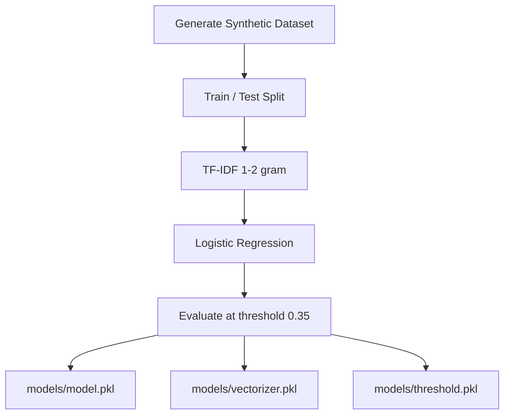

# Web IDS Project

Machine-learning-based Web Intrusion Detection System (Web IDS) for educational detection of suspicious web payloads such as SQL injection and cross-site scripting patterns.

Repository: `kktpx/Project_web-ids`

> This project is intended for defensive learning, experimentation, and testing in environments you own or are authorized to test. It should not be treated as a replacement for a production WAF, SIEM, or professionally managed security monitoring system.

---

## Overview

The project consists of two cooperating Flask applications:

1. **Web IDS (`app.py`)**
   - Receives payloads through an HTTP API
   - Converts payload text into TF-IDF features
   - Uses a trained Logistic Regression model to classify requests
   - Applies a saved probability threshold
   - Stores detection logs in SQLite
   - Displays protected dashboard/log pages
   - Can send alerts when an attack is detected

2. **Vulnerable Test Application (`todo_app.py`)**
   - Provides an intentionally vulnerable local test application
   - Can be used as a controlled source of requests for the IDS
   - Is intended only for local/authorized security testing

The repository also contains `train_model.py`, which generates a synthetic dataset, trains the text classifier, evaluates it, and stores the model artifacts in `models/`.

---

## Features

- HTTP `/detect` endpoint
- Text payload classification
- URL-decoding before classification
- TF-IDF feature extraction
- Logistic Regression classifier
- Custom attack probability threshold
- Attack / Normal classification
- Confidence score
- SQLite request logging
- Source IP logging
- Login-protected dashboard
- Paginated request log view
- Searchable log view
- Recent-attack dashboard
- Attack statistics
- Dark/light dashboard theme
- Discord alert support
- Synthetic training dataset generator
- Separate intentionally vulnerable Todo test app
- Gunicorn dependency for deployment
- Vercel configuration

---

## Tech Stack

### Backend

- Python
- Flask
- Gunicorn
- SQLite

### Machine Learning

- scikit-learn
- TF-IDF Vectorizer
- Logistic Regression
- joblib
- NumPy
- Pandas

### Integration

- Requests
- Discord Webhook

### Deployment

- Render-compatible Python web service
- Vercel configuration

---

## High-Level Architecture

```mermaid
flowchart LR
    Client[Test Client / Todo App] --> Detect[POST /detect]

    Detect --> Decode[URL Decode + Validate]
    Decode --> Vectorizer[TF-IDF Vectorizer]
    Vectorizer --> Model[Logistic Regression]
    Model --> Threshold[Attack Probability Threshold]

    Threshold -->|Normal| Log[(SQLite request_log)]
    Threshold -->|Attack| Log
    Threshold -->|Attack| Alert[Discord Alert]

    Log --> Dashboard[Protected Dashboard]
    Log --> Logs[Protected Logs Page]

    Admin[Admin Browser] --> Login[/login]
    Login --> Dashboard
    Login --> Logs
```

---

## Detection Flow

```text
JSON payload
    ↓
Validate request
    ↓
Trim payload
    ↓
URL decode
    ↓
TF-IDF transform
    ↓
Logistic Regression predict_proba
    ↓
Load saved threshold
    ↓
Attack / Normal decision
    ↓
Store timestamp, payload, prediction,
confidence and source IP in SQLite
    ↓
If Attack → send alert
    ↓
Return JSON response
```

---

## Machine-Learning Pipeline

`train_model.py` currently performs the following workflow:



### Current Training Design

The training script currently:

- Generates 10,000 synthetic samples
- Creates both Attack and Normal examples
- Includes SQL-injection-style and XSS-style patterns in the attack class
- Uses `TfidfVectorizer(ngram_range=(1, 2))`
- Splits data with a 30% test set
- Uses stratified train/test splitting
- Trains `LogisticRegression`
- Gives the Attack class more weight
- Uses a threshold of `0.35`
- Saves model, vectorizer, and threshold using `joblib`

This is suitable as an educational baseline, but synthetic data alone is not sufficient to claim production intrusion-detection quality.

---

## Project Structure

```text
Project_web-ids/
├── .gitignore
├── README.md
├── app.py
├── todo_app.py
├── train_model.py
├── generate_logs.py
├── payload_examples.txt
├── requirements.txt
├── vercel.json
├── models/
│   ├── model.pkl
│   ├── vectorizer.pkl
│   └── threshold.pkl
├── templates/
└── _ForUserOnly/
```

### Important Files

| Path | Purpose |
|---|---|
| `app.py` | IDS API, authentication, logging, dashboard and alerts |
| `todo_app.py` | Intentionally vulnerable test application |
| `train_model.py` | Dataset generation, training and artifact export |
| `models/model.pkl` | Trained classifier |
| `models/vectorizer.pkl` | Saved TF-IDF vectorizer |
| `models/threshold.pkl` | Saved classification threshold |
| `generate_logs.py` | Log generation helper |
| `payload_examples.txt` | Test payload examples |
| `requirements.txt` | Python dependencies |
| `vercel.json` | Vercel deployment configuration |

---

## Requirements

The repository currently declares:

```text
Flask
requests
pandas
scikit-learn
joblib
numpy
gunicorn
```

---

## Local Installation

### 1. Clone

```bash
git clone https://github.com/kktpx/Project_web-ids.git
cd Project_web-ids
```

### 2. Create a virtual environment

macOS / Linux:

```bash
python -m venv .venv
source .venv/bin/activate
```

Windows PowerShell:

```powershell
python -m venv .venv
.venv\Scripts\Activate.ps1
```

### 3. Install dependencies

```bash
python -m pip install --upgrade pip
pip install -r requirements.txt
```

### 4. Verify model artifacts

Before running `app.py`, verify:

```text
models/model.pkl
models/vectorizer.pkl
models/threshold.pkl
```

If they are missing, retrain:

```bash
python train_model.py
```

### 5. Run the IDS

```bash
python app.py
```

The Flask development server uses its normal local development address unless overridden.

Open:

```text
http://127.0.0.1:5000
```

The root route redirects to the login page.

### 6. Run the test application separately

Open another terminal and activate the same environment.

```bash
python todo_app.py
```

The repository documentation identifies the Todo app local port as:

```text
http://127.0.0.1:5001
```

Use the vulnerable test app only in a controlled local or authorized environment.

---

## API

### `POST /detect`

Expected JSON:

```json
{
  "payload": "example request text"
}
```

Example benign local request:

```bash
curl -X POST http://127.0.0.1:5000/detect \
  -H "Content-Type: application/json" \
  -d '{"payload":"search keyword=hello"}'
```

Example response shape:

```json
{
  "prediction": "Normal",
  "confidence": 0.97,
  "ip": "127.0.0.1"
}
```

Possible validation errors:

- Missing JSON body
- Missing `payload`
- Empty payload

---

## Main Routes

| Route | Method | Authentication | Purpose |
|---|---|---|---|
| `/` | GET | No | Redirect to login |
| `/login` | GET / POST | No | Administrator login |
| `/logout` | GET | Session | End admin session |
| `/detect` | POST | No | Classify a payload |
| `/dashboard` | GET | Required | IDS statistics and recent attacks |
| `/logs` | GET | Required | Searchable/paginated request logs |

---

## Database

The application uses SQLite.

Local database path:

```text
logs.db
```

When:

```text
VERCEL=1
```

the code uses:

```text
/tmp/logs.db
```

The database contains at least:

### `request_log`

Stores:

- ID
- timestamp
- payload
- prediction
- confidence
- IP address

### `admins`

Stores:

- ID
- username
- hashed password

---

## Important Security Notice

The current repository code contains development-time security values directly in source code, including a Flask secret, default administrator credentials, and a Discord webhook URL.

Before any public deployment:

1. Revoke/rotate the currently exposed webhook.
2. Remove webhook values from source control.
3. Replace hard-coded Flask `secret_key`.
4. Change the default administrator account/password.
5. Load secrets from environment variables.
6. Review Git history if a real webhook has ever been committed publicly.
7. Do not reuse any exposed secret elsewhere.

A safer target configuration would look like:

```env
SECRET_KEY=generate_a_long_random_value
ADMIN_USERNAME=your_admin_username
ADMIN_PASSWORD_HASH=your_password_hash
DISCORD_WEBHOOK_URL=your_rotated_webhook
DATABASE_PATH=logs.db
```

This is a recommended refactor. The current code must be changed to read these values before this `.env` layout will work.

Never commit `.env` containing real secrets.

---

## Recommended Production Configuration

Instead of:

```python
app.secret_key = "..."
```

use an environment-based configuration layer.

Recommended responsibilities:

```text
config.py
├── SECRET_KEY
├── DATABASE_PATH
├── DISCORD_WEBHOOK_URL
├── MODEL_PATH
├── VECTORIZER_PATH
└── THRESHOLD_PATH
```

Also add startup validation so the service fails clearly when required model artifacts or secrets are missing.

---

## Dashboard

The current dashboard displays:

- Total requests
- Attack count
- Normal count
- Attack rate
- Recent detected attacks

The log view includes:

- Timestamp
- Payload
- Prediction
- Confidence
- IP address
- Search
- Pagination

The application escapes payload text before placing it into generated HTML, which is important when rendering security-related input.

---

## Alerting

When the model predicts `Attack`, the application attempts to send an alert through a Discord webhook.

Recommended improvements:

- Move webhook URL to environment variables
- Add retry/backoff
- Add structured logging
- Add request timeout configuration
- Avoid logging secret URLs
- Queue alerts instead of delaying the HTTP request
- Add alert deduplication/rate limiting

---

## Deploying to Render

Typical configuration:

### Build Command

```bash
pip install -r requirements.txt
```

### Start Command

```bash
gunicorn app:app
```

For production:

- Configure environment variables in Render
- Use a persistent database if logs must survive restarts
- Rotate all exposed credentials before deploy
- Do not depend on the Flask development server

---

## Deploying to Vercel

The repository contains `vercel.json`.

The application switches SQLite to:

```text
/tmp/logs.db
```

when `VERCEL=1`.

Important limitation: ephemeral/serverless filesystems are not suitable for persistent security logs. Data can disappear between instances or deployments.

For persistent deployment, use an external database such as:

- PostgreSQL
- Managed SQLite-compatible service
- Another persistent database appropriate for the environment

---

## Model Retraining

Run:

```bash
python train_model.py
```

This rewrites:

```text
models/model.pkl
models/vectorizer.pkl
models/threshold.pkl
```

Before replacing a deployed model:

1. Save the old artifact version
2. Evaluate on a fixed holdout dataset
3. Compare precision/recall
4. Compare false-positive rate
5. Compare false-negative rate
6. Record training date/configuration
7. Deploy model and vectorizer together
8. Verify the saved threshold matches the model version

---

## Model Limitations

The current training data is synthetically generated. This creates several limitations:

- Real traffic can look different from generated examples
- Obfuscated attacks may not resemble training strings
- New attack patterns can be missed
- Normal technical text may create false positives
- A text classifier cannot understand full HTTP/session context
- Detection does not automatically block requests
- Model confidence is not equivalent to real-world security risk

Treat the system as an educational classifier, not a sole production defense.

---

## Recommended Evaluation

Track at least:

- Accuracy
- Precision
- Recall
- F1 score
- Confusion matrix
- False-positive rate
- False-negative rate
- Per-category detection if attack types are separated

Also maintain a test set that is not generated from the exact same pattern templates as the training set.

---

## Recommended Testing

### Unit Tests

Test:

- Empty payload validation
- URL decoding
- TF-IDF transform
- Threshold decision
- Database writes
- Dashboard stats
- Authentication helper

### API Tests

Test:

- `/detect` with benign input
- `/detect` without body
- `/detect` without payload key
- `/detect` with whitespace
- Login success/failure
- Unauthorized `/dashboard`
- Unauthorized `/logs`

### Security Tests

Only in an environment you own or are authorized to test:

- Session handling
- Default credentials removed
- Secrets absent from repository
- Dashboard output escaping
- Rate limiting behavior
- Input size limits
- Log retention

---

## Recommended Production Improvements

### Security

- Remove all committed secrets
- Rotate exposed credentials
- Add CSRF protection for state-changing admin forms
- Add rate limiting
- Limit request body size
- Add secure session cookie settings
- Add production password/account management
- Add audit logging
- Add structured server logs

### Architecture

- Separate Flask routes from detection service
- Separate database access into a repository layer
- Separate alerting into a service
- Move HTML templates out of large Python strings
- Use application configuration by environment
- Add database migrations
- Add model version metadata

### Machine Learning

- Use real sanitized/authorized datasets
- Add data provenance
- Split attack categories
- Add calibration analysis
- Compare additional classifiers
- Track model versions
- Add reproducible metrics
- Add drift monitoring if used continuously

---

## Suggested Scalable Architecture

```mermaid
flowchart LR
    Proxy[Reverse Proxy / App] --> API[IDS API]
    API --> Detect[Detection Service]
    Detect --> Model[Versioned ML Model]

    Detect --> DB[(Persistent Database)]
    Detect --> Queue[Alert Queue]
    Queue --> Discord[Discord / Notification]

    Dashboard[Dashboard] --> API
    API --> Auth[Authentication]
    API --> DB

    Metrics[Metrics / Logs] <-- API
```

---

## CI/CD Recommendation

A basic CI pipeline should run:

```text
Install
  ↓
Lint
  ↓
Unit Tests
  ↓
API Tests
  ↓
Model Smoke Test
```

A model smoke test can simply confirm that:

- Model files load
- Vectorizer loads
- Threshold loads
- A known benign sample returns a valid response structure

Do not automatically promote a retrained security model to production without evaluation.

---

## Troubleshooting

### `FileNotFoundError` for model files

Run:

```bash
python train_model.py
```

Then verify `models/`.

### SQLite database problems on serverless deployment

Use an external persistent database rather than relying on `/tmp`.

### Discord alerts fail

After rotating the exposed webhook:

- Verify the new webhook is configured
- Verify outbound requests are allowed
- Check request timeout/network errors
- Keep the webhook out of logs and source control

### Too many false positives

Do not simply lower/raise thresholds blindly.

Instead:

1. Save misclassified examples
2. Create a clean validation set
3. Retrain or recalibrate
4. Measure precision/recall after each change

---

## Responsible Use

Use the vulnerable test application only:

- Locally
- In a lab
- In a CTF/training environment
- Against systems you own
- Against systems you have explicit permission to test

Do not expose an intentionally vulnerable application to the public internet without appropriate isolation.

---

## License

No license is currently documented in this README. Add a `LICENSE` file if you want to define redistribution and reuse terms.
